# API Security Framework

The Sirius framework is described below. This is a security component that will be used by the Sirius project

### 1. Overview	

The Sirius example shows a confidential and security dialogue between a Go consumer application and its Go server. The system components are:

* Client application that encrypts and decrypts the server response with cryptographic elliptic curve
* Dispatcher that manages the request and response to the client and is also responsible for the encrypted responses.
* Core System who are Go Microservices that manage the request with ETCD
  * Register who save the client's credentials in ETCD
  * Finder how search for ETCD client credentials among all registered indexed rows
  * Login,  it will generate a new security token for the consumer
  * Cleaner who remove UUID token that tracks communication.

* Docker, like PaaS
* WSO2 as API Management for REST API
  * Generate the custom access token for the consumer
  * Maintain consumer credentials.

* ETCD database with very high scalability and speed.
  * Persist information in memory

* Elliptic curve cryptography that protects the Framework
  * Ensure that communications are signed and confidential.

* RSocket protocol for microservices integration
  * Ensure rapid communication of microservices.

* Docker as PaaS

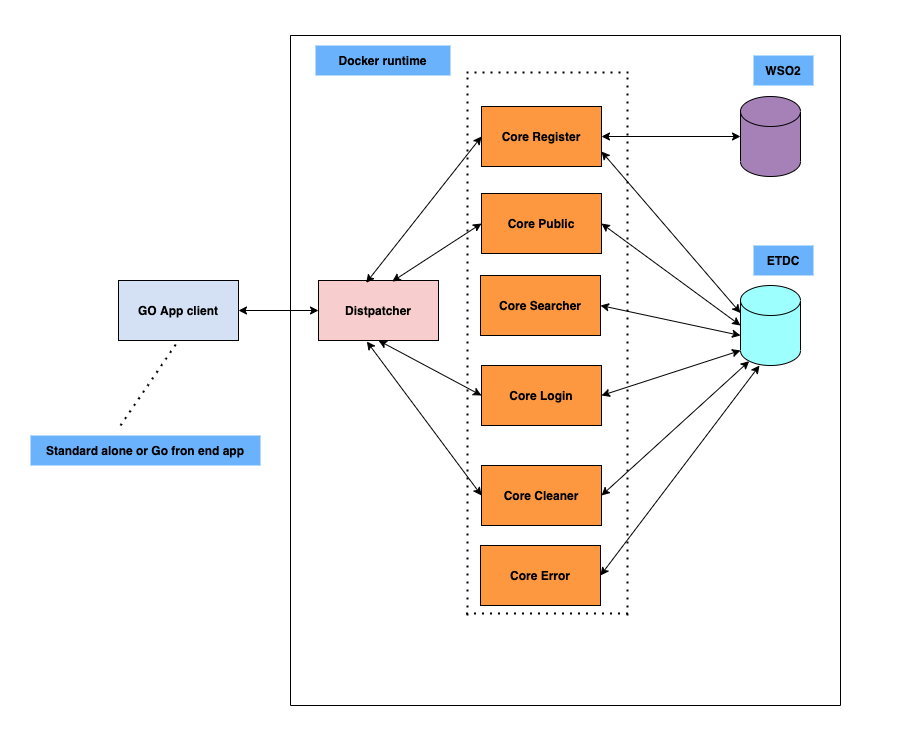

### 2. Secuence schema
#### 2.1 Onboarding

In the first step of onboarding the secure dialog is estableced


In second step of onbarding it is registered the consumer in WSO2 han his cliend ID is used to build the onboarding token who is stored in ETCD.


#### 2.2 Login

When the onboarding is made the consumer can get token with his internal credentials (faceID, Agent Device and public IP), so it is posible to get the access token to the resources.


#### 2.3 Comsuption

With the login token get it in the previous step the consumer can access the resources only with it's token that has been generated by a secure and concidential dialog so it can be monitored and controlled by a WSO2 API Manager.


### 3. Test the project
All that you need to test it is:

* Docker as PaaS
* WSO2 3.2.0 running on Docker
* Up the Microservice, it is necesary update all the IP generared for each deployment in the Constant file
* Run the app consumero with the proper params (onboarding, login, etc)

#### 3.1 Tutorial

Follow the next steps:

##### 3.1.1 Install WSO2 with docker compose 

Cloning https://github.com/wso2/docker-apim
    
For running it I replace the docker file images from the oficial WSO2 to the alpine, that are:
* wso2/wso2am:3.2.0-alpine
* wso2/wso2am-analytics-dashboard:3.2.0-alpine
* wso2/wso2am-analytics-worker:3.2.0-alpine
  

Up the docker compose, for example as a daemon.


Then you can se all ok with something like this:

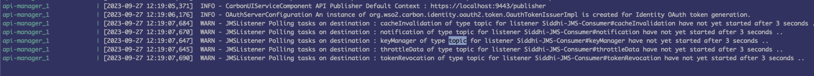

And accesing with admin / admin, we can see a clean API environment:

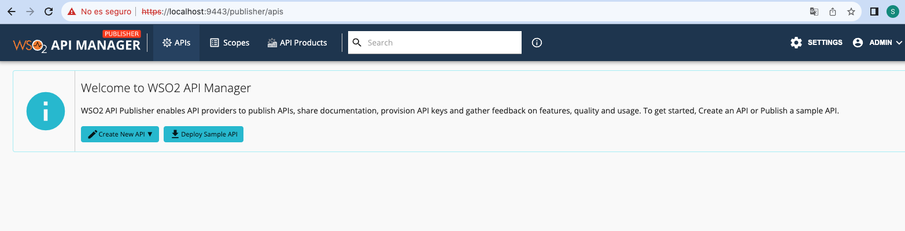


##### 3.1.2 Install APIs

If you don't have a environment previasly created, you can go with this steps:

* Create a new local environment. For this in the apitoolkit carpet execute from bash:
```bash
./apictl add-env -e local --apim https://localhost:9443
```

* Visualize the previus local environment created and login it:
```bash
./apictl list envs
./apictl login local -k
```
* Import the API distpatcher:
```bash
./apictl import-api --file ./../Apis/api-sirius-dispatcher/api-sirius-dispatcher-v1 --environment local -k --preserve-provider=false --update
```

Now you can see the imported API in the publisher WSO2 console:

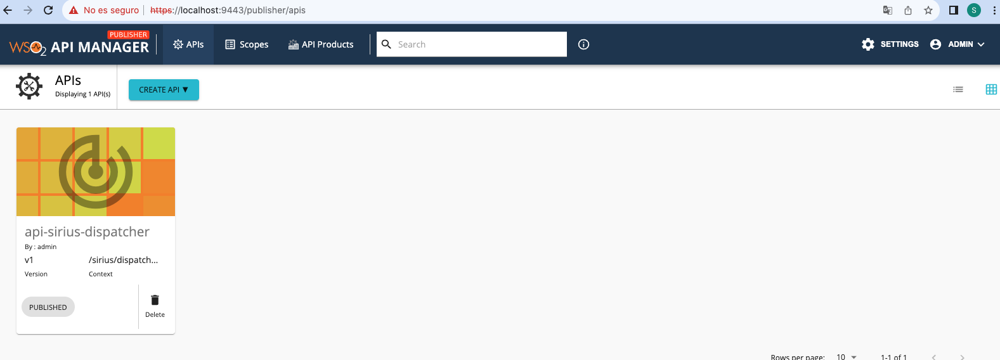

```bash
./apictl import-api --file ./../Apis/api-sirius-login/api-sirius-login-v1 --environment local -k --preserve-provider=false --update
```
Now you can see the imported API in the dev portal WSO2 console:

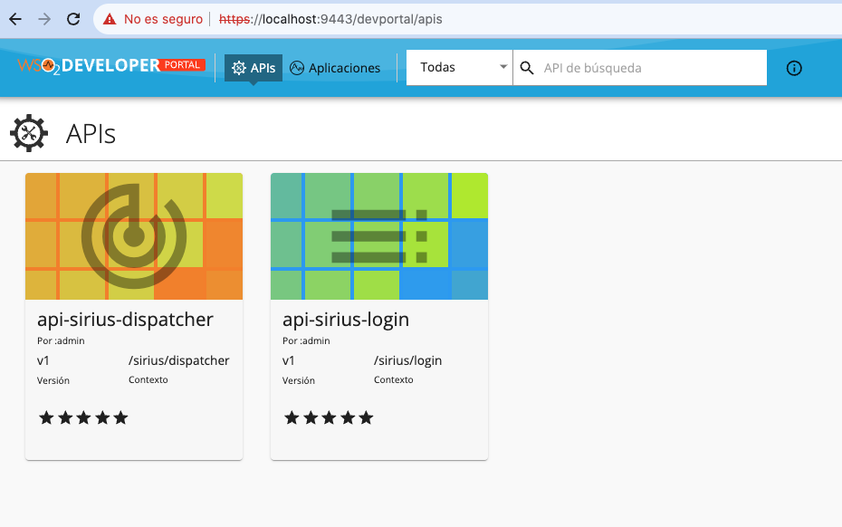

##### 3.1.3 Config microservices

In this first version it is necessary to deploy the micros with Docker to discover their internal IPs, make some adjustments and then carry out the final deployment. In subsequent versions, it would be necessary to automate these settings :)

Step by step:

###### 3.1.3.0 Discover IP's

In each of 7 microservices root folder (dispatcher, register, searcher, cleaner, error, login, public) execute:
```bash
./deploy.sh
```
You have to write down each of your IPs from the property called 'Gateway' after running the command and inspecting in the 7 related containers, for example:

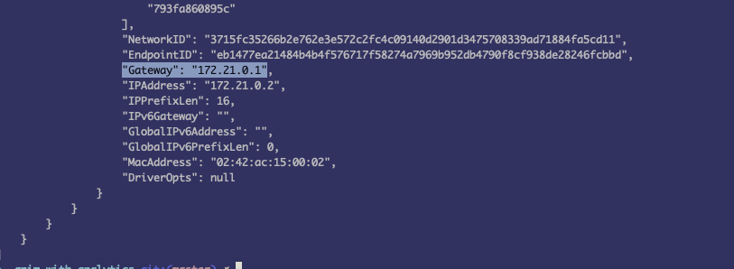


###### 3.1.3.1 Ajust IP in sources

You have to adjust the constants of the 7 microservices with their values. For example, in dispatcher micro, it is necesary to change the follow properties in the constants.go file:

```bash
	DOCKER_GW_IP              = `172.19.0.1`
	DOCKER_GW_REGISTER_IP     = `172.21.0.1`
	DOCKER_GW_LOGIN_IP        = `172.23.0.1`
	DOCKER_GW_PUBLIC_IP       = `172.22.0.1`
	DOCKER_GW_SEACHER_IP      = `172.20.0.1`
	DOCKER_GW_CLEANER_IP      = `172.25.0.1`
	DOCKER_GW_ERROR_IP        = `172.24.0.1`
```

###### 3.1.3.2 Validate API Manager IP 

Same that above, you have to validate the WSO2 IP corresponding with API Manager match with value 172.18.0.1. If not, you have to update all the HostWso2Docker value in all the 7 file constants.go 

###### 3.1.3.3 Create 'sirius' app in WSO2 Dev Portal

Accessing to https://localhost:9443/devportal/applications create a new App that have to be suscribed at least to 'api-sirius-login', as can be see below:

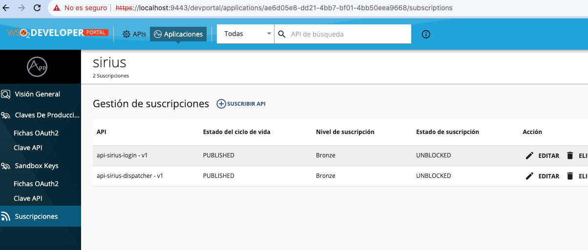

###### 3.1.3.4 Update client credentials

You have to update the property BASIC_GENERIC_CREDENTIALS in client app with the values of the sirius WSO2 app after convert client_id:client_secret to base64 encoding.

Also update the API Key for login API in the property API_KEY_CRYPTO of the client's constants.go file.  It can be obteined from developer portal sirius api:

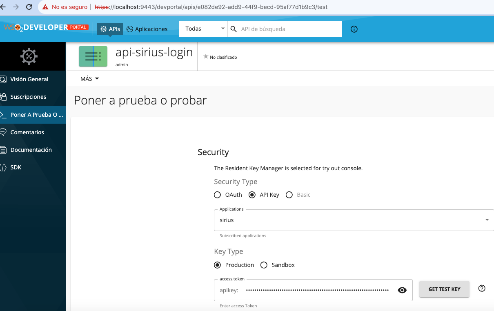

###### 3.1.3.5 Update API Id for Register microservice

For allow the Micro consuming the dispatcher API it is necesary update the value of the body.ApiId property in the utils.go go code in the register micro service with the value that can be obtained by the following path:

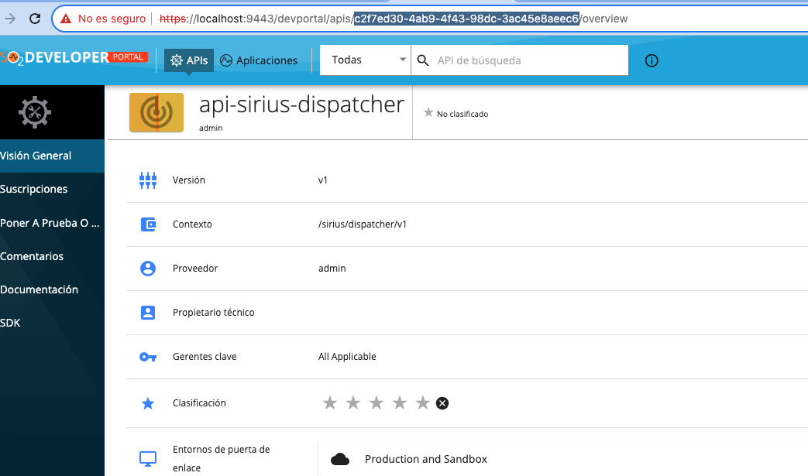


##### 3.1.4 Install ETCD

For this task it is necesary create the ETCD container with the following command:

```bash
docker run -d --name Etcd-server \
    --network apim-with-analytics_default \
    --publish 2379:2379 \
    --publish 2380:2380 \
    --env ALLOW_NONE_AUTHENTICATION=yes \
    --env ETCD_ADVERTISE_CLIENT_URLS=http://etcd-server:2379 \
    bitnami/etcd:latest
```

And it is interesting install also some software to visualize the data, for example ETCD Manager as can see:


##### 3.1.5 Test

With API and Microservice running, the first step is excecute the onboardin proccess. For it, you have to execute from bash, in the client root folder:

```bash
go run main.go --operation="onboarding"
```

As a result of this, you can see one app created and suscrited to API dispatcher in WSO2 platform and a registry in ETCD, as can see below:

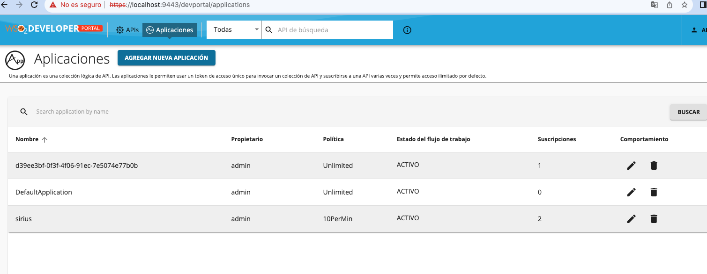

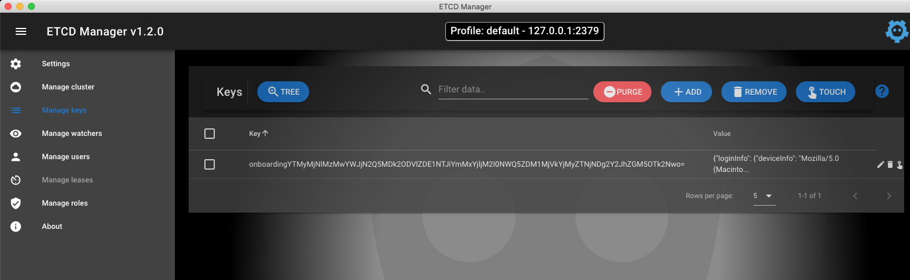

```bash
bash-3.2$ go run main.go --operation="onboarding"
2023/10/02 13:33:29 Call publicKey
2023/10/02 13:33:30 Onboarding syncr took 0.918834
bash-3.2$ 
```

As the onboarding procces is ok, it is time to login and consume the resources, with this command:

```bash
go run main.go --operation="test"
```

As a result of this, you can see a registry with the login token in ETCD, as can see below:

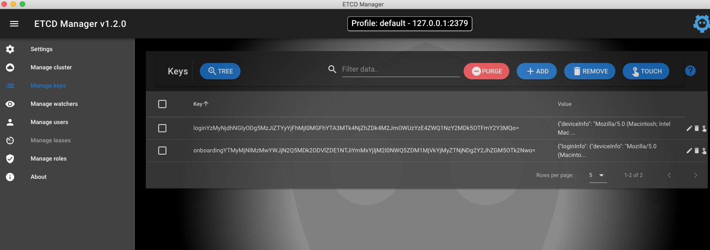

```bash
bash-3.2$ go run main.go --operation="test"
2023/10/02 13:30:26 Call publicKey
2023/10/02 13:30:27 Login syncr took 1.064822
2023/10/02 13:30:27 62eewKbLQ21ogEUKvj8fTjTPbLFxr2H7kT57sdgyE1Tm
2023/10/02 13:30:27 Consumption syncr took 1.313841
```

#### 3.2 Conclusion

In the PoC you can see how works the API Security Framework for give the applications a secure and confidencial consuming of the resources.

In next steps I want to automate the whole process so it will no necesary ajust the configurations manually.

