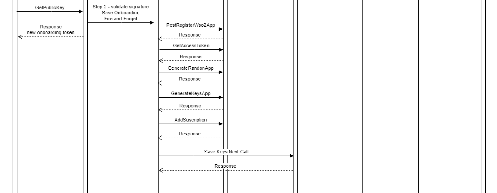

# API Security Framework

The Sirius framework is described below. This is a security component that will be used by the Sirius project

### 1. Overview	

The Sirius example shows a confidential and security dialogue between a Go consumer application and its Go server. The system components are:

* Client application that encrypts and decrypts the server response with cryptographic elliptic curve
* Dispatcher that manages the request and response to the client and is also responsible for the encrypted responses.
* Core System who are Go Microservices that manage the request with ETCD
  * Register who save the client's credentials in ETCD
  * Finder how search for ETCD client credentials among all registered indexed rows
  * Login,  it will generate a new security token for the consumer
  * Cleaner who remove UUID token that tracks communication.

* Docker, like PaaS
* WSO2 as API Management for REST API
  * Generate the custom access token for the consumer
  * Maintain consumer credentials.

* ETCD database with very high scalability and speed.
  *Persist information in m

* Elliptic curve cryptography that protects the Framework
  * Ensure that communications are signed and confidential.

* RSocket protocol for microservices integration
  * Ensure rapid communication of microservices.

* Docker as PaaS

### 2. Secuence schema
#### 2.1 Onboarding

In the first step of onboarding the secure dialog is estableced

In second step of onbarding it is registered the consumer in WSO2 han his cliend ID is used to build the onboarding token who is stored in ETCD.

#### 2.2 Login

When the onboarding is made the consumer can get token with his internal credentials (faceID, Agent Device and public IP), so it is posible to get the access token to the resources.

#### 

#### 2.3 Comsuption

With the login token get it in the previous step the consumer can access the resources only with it's token that has been generated by a secure and concidential dialog so it can be monitored and controlled by a WSO2 API Manager.

#### 

### 3. Test the project
All that you need to test it is:

* Docker as PaaS
* WSO2 3.2.0 running on Docker
* Up the Microservice, it is necesary update all the IP generared for each deployment in the Constant file
* Run the app consumero with the proper params (onboarding, login, etc)

